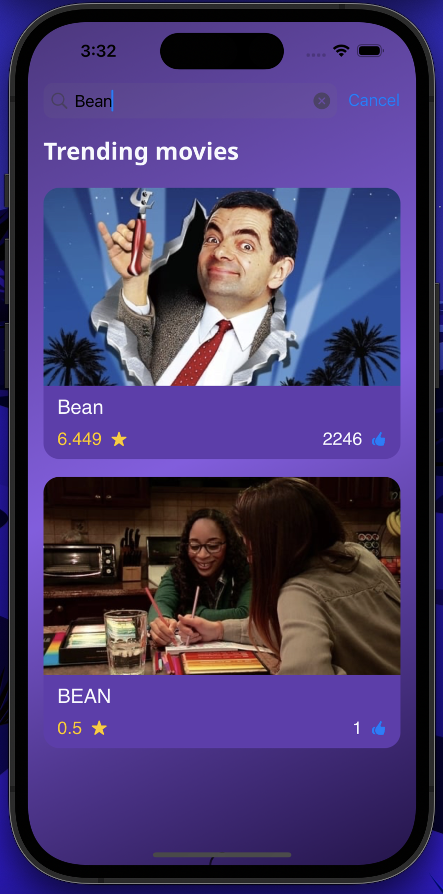
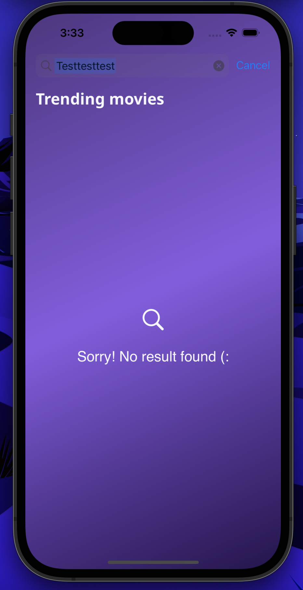

# Yassir technical Test Movie-DB:
iCenema is an application that seamlessly integrates with the TMDB API to showcase a curated collection of movies.
Its intuitive design provides a delightful user experience, allowing users to explore, discover, and enjoy their favorite films effortlessly.

## Table of Contents
###   (*) Requirements:
* XCode 14.3 or higher.
* iOS 15 or higher.

###   (*) features:
* Movies browsing.
* Movie detais(year of production, rating, category..).
* Movie search.

### (*) app architecture:
- The iCenema app follows the Model-View-ViewModel (MVVM) architecture:
- Model:
  - Represents the data layer and business logic.
  - Manages the interaction with the TMDB API to fetch and handle movie data.
  - Includes data structures and entities that represent the movie information.
- View:
  - SwiftUI views responsible for rendering the UI elements, displaying movie information, and handling user interactions.
  - Views are kept as lightweight as possible, focusing on displaying the data provided by the ViewModel.
- ViewModel:
  - Encapsulates the presentation logic and state of the UI.
  - Manages the transformation of raw movie data from the Model into a format that can be easily consumed by the View.
  - Responds to user interactions and communicates with the Model to update data.
- Binding:
  - Utilizes SwiftUI's two-way data binding to keep the ViewModel and View in sync.
- Dependency Injection:
  - Promotes a loosely coupled architecture by injecting dependencies like the ViewModel into the View.

## (*)  Screenshots

  
  
  
   
  

  
  <!-- Add more images as needed -->

 
